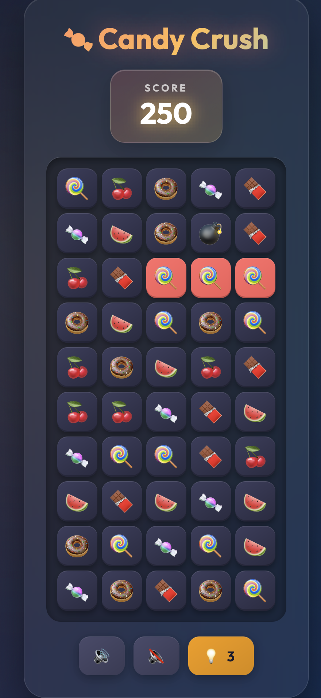

# 🍬 Candy Crush

A browser-based puzzle game inspired by Candy Crush Saga.



## ✨ Features

- **Match-3 Gameplay** - Swap candies to match 3+ in a row/column
- **Special Items**
  - 💣 Line Bomb - Clears entire row & column
  - 🧨 Cross Bomb - Clears surrounding 8 cells
- **Score System** - Points for matches with combo bonuses
- **Hint System** - Auto-hint after 15s or use hint button (3 uses)
- **Sound Effects** - BGM and match/drop sounds

## 🎮 How to Play

1. Click a candy to select it
2. Click an adjacent candy to swap
3. Match 3+ same candies to score
4. Click bombs directly to activate them

## 🚀 Getting Started

```bash
# Start local server
python3 -m http.server 8080

# Open in browser
open http://localhost:8080/html/candy.html
```

## 🎵 Controls

| Button | Action |
|--------|--------|
| 🔊 | Sound On |
| 🔇 | Sound Off |
| 💡 | Get Hint |

## 📁 Project Structure

```
candy/
├── html/candy.html   # Game page
├── css/main.css      # Styles
├── js/candy.js       # Game logic
└── mp3/              # Sound files
```

## 👨‍💻 Authors

- DONG KI, SIN & Harry

## 📄 License

MIT License
